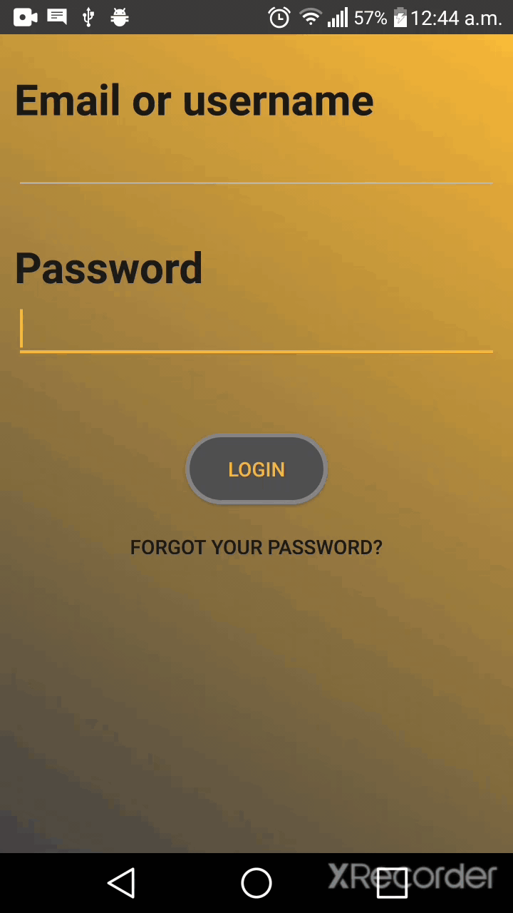
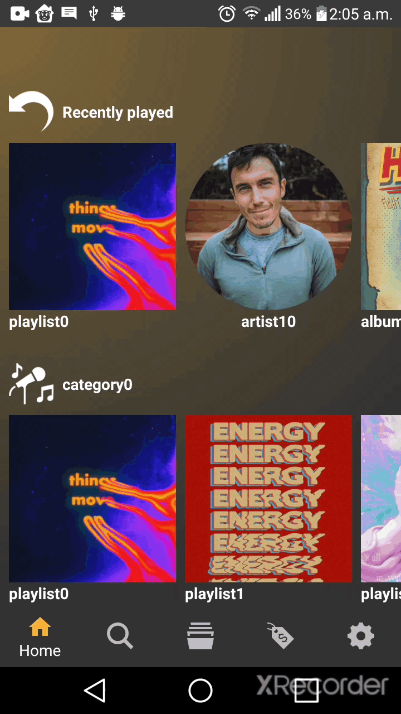
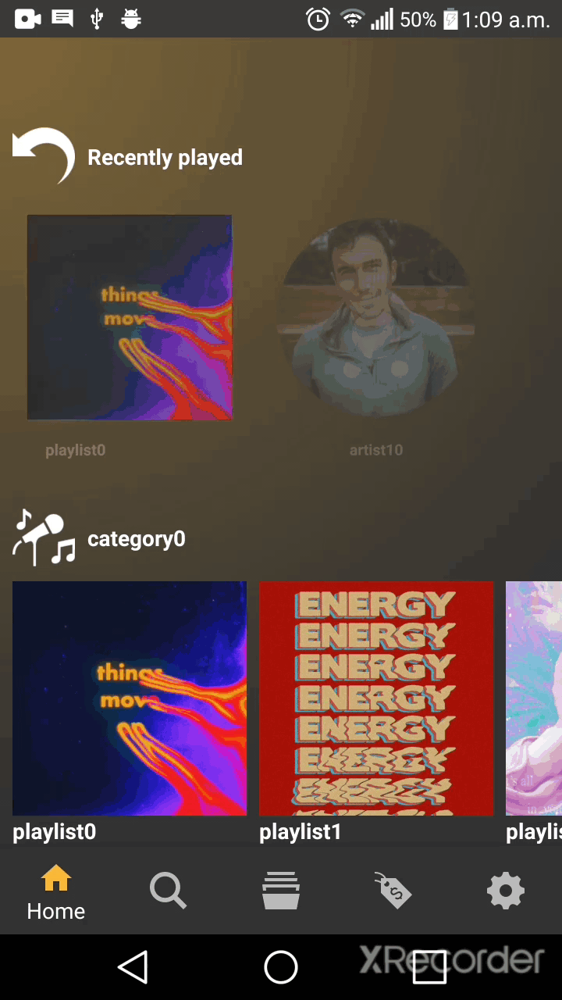

# Oud
<div align="center">

</div>

## Table of contents
- [About](#about)
- [Getting started](#getting-started)
- [Running](#running)
    - [Using the mock server](#using-the-mock-server)
    - [Using the real server](#using-the-real-server)
- [Showcasing](#showcasing)
- [Notes about the code](#notes-about-the-code)
- [File structure](#file-structure)
- [Unit tests](#unit-tests)
- [Functional documentation](#functional-documentation)
- [See also](#see-also)

## About
> Oud's android app. Oud is a mimic of spotify with all its features and functionalities.

## Getting started
1) Install Android Studio.
2) Import project & let gradle do its magic!!

## Running 
### Using the mock server
1) Install node.js.
2) Install json-server. `npm install -g json-server` or head to their github page for more detailes. https://github.com/typicode/json-server
3) Change the local ip address of your machine(labtop/pc) to `192.168.1.198`. Or you can alternatively open `Constants` class and change a constat called `YAMANI_MOCK_BASE_URL` to match your local ip. Make sure to also change the port number in this constant if you changed the default one when running the server.
4) Open `json-server` folder in the terminal & copy paste the command found in `terminal_command.txt` file (exists in `json-server` folder) in your terminal window to run the server.
- make sure that private networks is allowed. (This depends on your os)

### Using the real server
- Simply change a constant named `MOCK` (inside `Constants` class) to `false`.
- Currently shutdown unfortunately.

## Showcasing
| Login/signup navigation                     | Login                     | Home                               |
|:-------------------------------------------:|:-------------------------:|:----------------------------------:|
|  |  |  |

| Playlist                     | Artist                     | Library                     |
|:----------------------------:|:--------------------------:|:---------------------------:|
|  |  |  |


| Player                     | Settings                     | Premium                     |
|:--------------------------:|:----------------------------:|:---------------------------:|
|  |  |  |

## Notes about the code
- `connectionaware` is a package containing a very important set of class that evey fragment/activity use.
    - When they sense a failed server connection, they prompt the user with a message saying `You are offline` and a refresh button.
    - All of this happens consistently across the entire app whitout any intervention from any fragement.
    - Fragments must inherit from `ConnectionAwareFragment`.
    - Activities must implement `ConnectionStatusListener`.
    - Every server call must be done using the `FailureSuccessHandledCallback` class.

## File Structure
```
.
├── app
│   └── src
│       ├── main
│       │   ├── java
│       │   │   └── com
│       │   │       └── example
│       │   │           └── oud
│       │   │               ├── api
│       │   │               ├── artist
│       │   │               │   └── fragments
│       │   │               │       ├── albums
│       │   │               │       ├── bio
│       │   │               │       ├── home
│       │   │               │       └── settings
│       │   │               ├── authentication
│       │   │               ├── connectionaware
│       │   │               ├── dummy
│       │   │               └── user
│       │   │                   ├── fragments
│       │   │                   │   ├── artist
│       │   │                   │   ├── home
│       │   │                   │   │   └── nestedrecyclerview
│       │   │                   │   │       ├── adapters
│       │   │                   │   │       └── decorations
│       │   │                   │   ├── library
│       │   │                   │   │   ├── artists
│       │   │                   │   │   ├── likedtracks
│       │   │                   │   │   ├── notifications
│       │   │                   │   │   ├── playlists
│       │   │                   │   │   └── savedalbums
│       │   │                   │   ├── playlist
│       │   │                   │   ├── premium
│       │   │                   │   │   ├── database
│       │   │                   │   │   ├── offlinetracks
│       │   │                   │   │   └── redeemsubscribe
│       │   │                   │   ├── profile
│       │   │                   │   ├── search
│       │   │                   │   └── settings
│       │   │                   ├── player
│       │   │                   │   └── smallplayer
│       │   │                   └── ui
│       │   │                       └── main
│       │   └── res
│       │       ├── anim
│       │       ├── layout
│       │       ├── menu
│       │       ├── navigation
│       │       └── values
│       └── test
├── json-server
│   ├── db.json
│   └── routes.json
└── tryingstuff
    └── src
        └── main
            └── java
                └── com
                    └── example
                        └── tryingstuff
                            └── OudApiJsonGenerator.java
```

## Unit tests
1) Write click on `oud.example.oud (test)` and choose `Run tests in Oud` or `Run test in Oud with coverage`.
<div align="center">

</div>

## Functional documentation
In Android Studio `Tools -> Generate JavaDoc...`

## See also
- [Backend](https://github.com/Hassan950/OudBackEnd)
- [Frontend](https://github.com/AbdallahHemdan/Oud)
- [End-to-end testing](https://github.com/Thebrownboy/Oud_TestingTeam)
